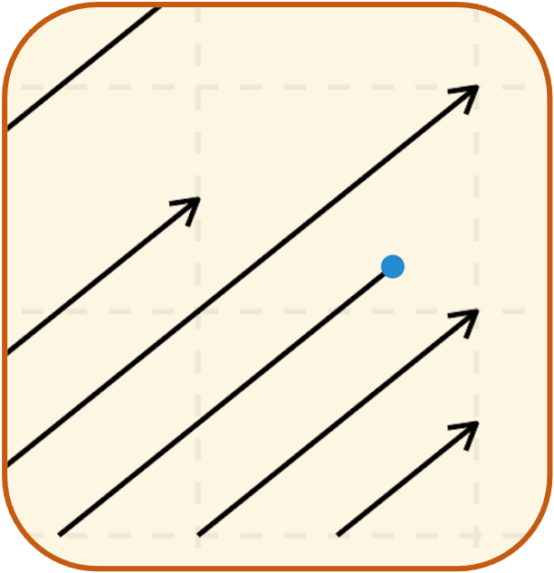

# EPID 722: Advanced Epidemiologic Methods (Spring 2021)

## Theme

This site is based on the beautiful set of course websites designed by Andrew Heiss (https://www.andrewheiss.com/). Like his sites, this site uses the [Academic Hugo theme](https://sourcethemes.com/academic/), with some slight template modifications found in `/assets/` and `layouts/`. The theme is included as a submodule, so when when cloning for the first time, use the `--recursive` command to get the theme too.
